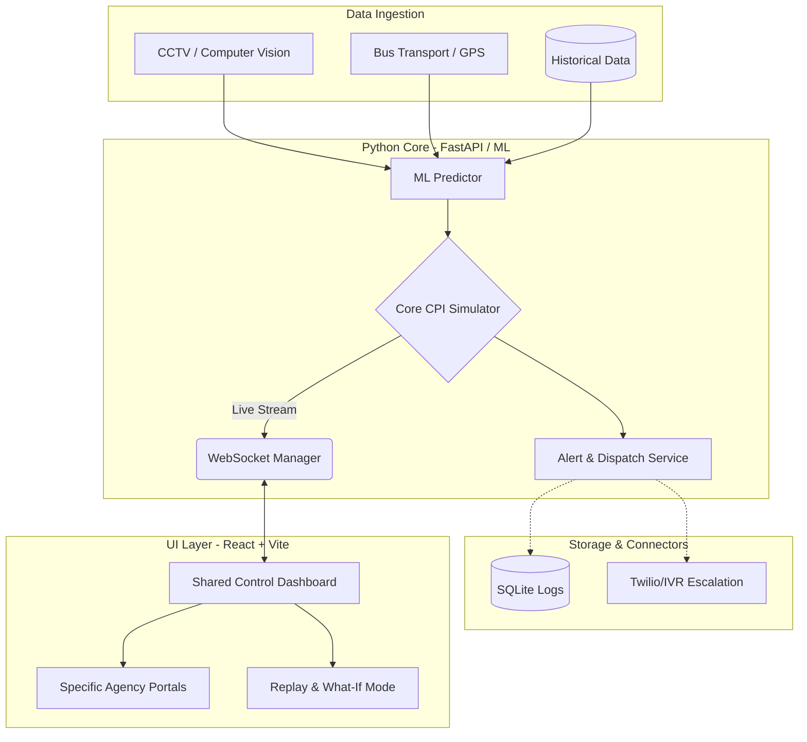
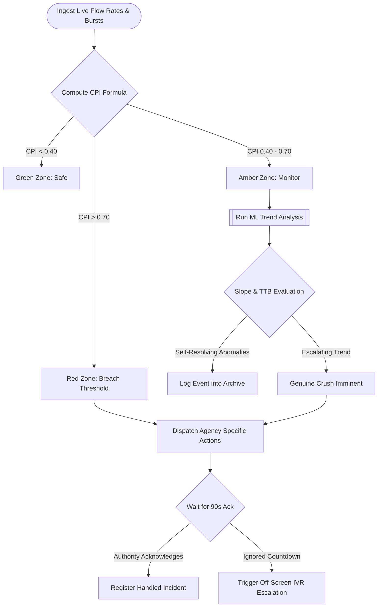

# 🏛️ Tarkshastra (TS-11) — Navigation & Crowd Intelligence System
**Gujarat Pilgrimage Corridors · Real-Time Stampede Window Predictor**
🚀 **Live Demo:** [https://ts11-frontend.onrender.com](https://ts11-frontend.onrender.com) *(May take ~50s for Render cold start)*

Tarkshastra is an advanced, real-time Crowd Intelligence and Stampede Prediction System designed to predict crush risks 8–12 minutes ahead for major pilgrimage sites (Ambaji, Dwarka, Somnath, and Pavagadh) in Gujarat. It utilizes a custom **Corridor Pressure Index (CPI)** engine backed by historical crowd observation data to pre-emptively alert specific administrative and transport agencies.

---

## 🎯 The Problem
Mass gatherings and pilgrimage sites often experience sudden, unpredicted surges in crowd density resulting in chokepoints, stampedes, and casualties. Traditional systems are reactive. There is a critical need for a **proactive** system that can predict chokepoints and provide actionable alerts to respective authorities before a critical threshold is breached.

## 💡 Our Solution
Tarkshastra creates a **predictive digital twin** of the pilgrimage corridors. By continually analyzing crowd flow rates, transport burst factors (e.g., bus arrivals), and chokepoint densities, the system calculates a real-time CPI. It broadcasts this index via WebSockets and features a predictive machine learning module to estimate the **Time-To-Breach (TTB)**, categorizing surges into genuine crushes or self-resolving anomalies.

---

## 🏗️ System Architecture Pipeline



## 🔄 Operational Data Flowchart



---

## 🧪 Core Algorithm: Corridor Pressure Index (CPI)

The heart of Tarkshastra is the CPI Formula, which dynamically assesses corridor risk:

```math
\text{CPI} = \left( \frac{\text{Flow Rate (PPM)}}{\text{Capacity (PPM)}} \right) \times 0.5 
+ \text{Transport Burst Factor} \times 0.3 
+ \text{Chokepoint Density Norm} \times 0.2
```

**Colour Zones & Thresholds:**
- 🟢 **Green (Safe):** 0 – 0.40  
- 🟠 **Amber (Caution):** 0.40 – 0.70  
- 🔴 **Red (Danger):** 0.70 – 1.0  
- 🚨 **Breach Threshold:** 0.85

---

## ✨ Key Features (Evaluator's Guide)

| 🔥 Feature | 📝 Description | 🎯 Impact |
|---|---------|--------|
| **Real-time CPI Engine** | Dynamic calculation of pressure index across 4 corridors with 2s WebSocket updates. | Immediate situational awareness. |
| **8–12 Min Predictive TTB** | Calculates slope-based Time-To-Breach to predict unresolving surges. | Proactive crowd control. |
| **Smart Surge Classifier** | Differentiates between `GENUINE_CRUSH`, `SELF_RESOLVING`, and `PREDICTED_BREACH` events. | Reduces false positive alerts. |
| **Multi-Agency Dashboards** | Route-based UI (`?agency=police`, `temple`, `gsrtc`) showing relevant action cards. | Tailored, rapid response protocols. |
| **Alert-to-Ack Tracking** | 90s countdown timer for agencies to acknowledge critical alerts via SQLite state tracking. | Accountability and escalation tracking. |
| **"What-If" Simulator** | Allows authorities to inject custom transport bursts to see potential impacts on the CPI. | Strategic planning and training. |
| **Replay Mode** | 20-min DVR-style replay (play/pause/2×/4×) with PREDICTION and PEAK markers. | Post-incident analysis and system audit. |
| **Automated Reporting** | Generates PDF reports and exports sortable event logs as CSV files. | Compliance and data logging. |
| **Voice Calls / IVR** | Automated call service alerts using Twilio integration. | Ensures authorities are instantly notified off-screen. |

---

## 💻 Tech Stack

- **Backend:** Python 3.11, FastAPI, WebSockets, aiosqlite, Scikit-Learn (ML), Twilio
- **Frontend:** React 18, Vite, TailwindCSS, Recharts (Data Viz), Leaflet (Maps)
- **Deployment:** Render (Automated CI/CD via `render.yaml`)

---

## 🚀 Local Development Setup

### 1. Backend Setup
```bash
cd backend
python -m venv venv
source venv/bin/activate  # On Windows use `venv\Scripts\activate`
pip install -r requirements.txt
cp .env.example .env      # Add your Twilio/OpenAI keys if applicable
uvicorn main:app --reload --port 8000
```

### 2. Frontend Setup
```bash
cd frontend
npm install
cp .env.example .env       # set VITE_WS_URL and VITE_API_URL
npm run dev
```

### 3. Access Agency Views
- Police: `http://localhost:5173/?agency=police`
- Temple Trust: `http://localhost:5173/?agency=temple`
- GSRTC Transports: `http://localhost:5173/?agency=gsrtc`

---

## 🌐 API Reference

| Method | Path | Description |
|--------|------|-------------|
| `GET`  | `/health` | Health check + wake endpoint |
| `WS`   | `/ws` | Live CPI stream (every 2 s) |
| `GET`  | `/api/corridors` | Corridor configurations |
| `GET`  | `/api/events` | Last 50 CPI log entries |
| `GET`  | `/api/events/export` | Download events as CSV |
| `GET`  | `/api/alerts` | Last 50 fired alerts |
| `POST` | `/api/ack/{alert_id}/{agency}` | Acknowledge alert |
| `GET`  | `/api/replay?frame=N` | Single replay frame |
| `GET`  | `/api/replay/all` | All 240 replay frames |

---

## ☁️ Deployment

A `render.yaml` configuration is included at the repository root. Connect the GitHub repository to Render to automatically deploy both the backend and frontend services.

> **Note on Cold Starts:** The frontend automatically pings `/health` on load to wake the Render backend instance from any cold start delays.
